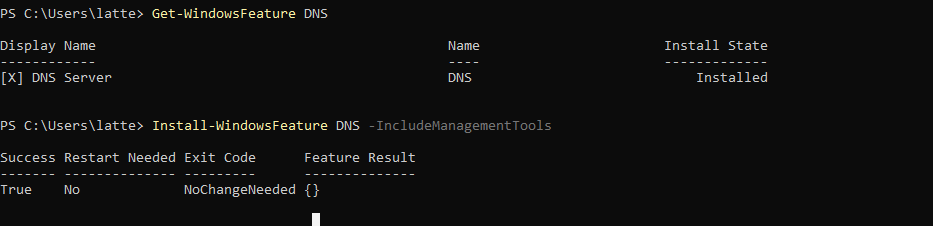
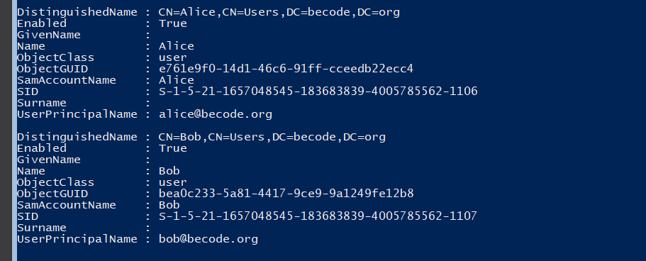

# Active Directory Setup

In this guide, we will be setting up an Active Directory Domain Controller on Windows Server 2022. We will be creating a new domain, adding users, and creating groups in an VM secure environment.

## Installation
 
 We first download the Windows Server 2022 ISO from the [Microsoft Evaluation Center](https://www.microsoft.com/en-us/evalcenter/evaluate-windows-server-2022) and create a new VM in VirtualBox. 

 And due to the fact that we have the Core version of Windows Server 2022, we will be using the command line to install the Active Directory Domain Services role. 

## Configuration
1. **Static IP Address**
 We will as well give a static IP address to the server.
 First we check the network adapter name by running the following command:

    ```powershell
    Get-NetAdapter
    ```
    

    In our case the network adapter name is `Ethernet`. 

    **Note**:  If the "Ethernet" already exists- we simply remove the existing IP address and set the new one. 
      
      ```powershell
        Remove-NetIPAddress -InterfaceAlias "Ethernet"
      ```  
    We will then set the static IP address by running the following command: 

    ```powershell
        New-NetIPAddress -InterfaceAlias "Ethernet" -IPAddress 10.0.2.15 -PrefixLength 24 -DefaultGateway 10.0.2.2
      ```
      

  In this case:
 - **10.0.2.15** is the static IP address assigned to the server.
 - **24** corresponds to the subnet mask **255.255.255.0** (a /24 in CIDR notation).
 - **10.0.2.2** is the default gateway for the network.

    

    We can check the IP address by running the following command:

    ```powershell
    Get-NetIPAddress -InterfaceAlias "Ethernet"
    ```

    

1. **Install Active Directory Domain Services Role**

    We open PowerShell as an administrator - by simply typing `powershell`  and run the following command to install the Active Directory Domain Services role:

    ```powershell
    Install-WindowsFeature -Name AD-Domain-Services -IncludeManagementTools
    ```
   

2. **Promote the server to a domain controller**

    After the installation is complete, we run the following command to promote the server to a domain controller:

    ```powershell
    Install-ADDSForest -DomainName "becode.org" -DomainMode WinThreshold -ForestMode WinThreshold
    ```
    We will pe prompted to set a Directory Services Restore Mode (DSRM) password.

    In our case the domain name is `becode.org` and the password is `kamkar8955!`.

    
    And we restart. 

3. **Verify Installation**
    
    After the server restarts, we log back in and use PowerShell to verify that Active Directory was installed successfully.

    - Check the Active Directory Domain Services Role:
    ```powershell
    Get-WindowsFeature AD-Domain-Services
    ``` 
    This command should show that the Active Directory Domain Services role is installed.

    - Test Active Directory Functionality: Ensure you can query your AD domain.

    ```powershell
    Get-ADDomain
    ```
    This command requires the RSAT-AD-PowerShell feature, which should be installed as part of the management tools with AD DS. If for any reason it's not, you can install it using Install-WindowsFeature RSAT-AD-PowerShell.
    

    - Check the Domain Controller:
    ```powershell
    Get-ADDomainController
    ```
     


5.  **Install the DNS.** 
   We first check the DNS role is installed by running the following command:
  
    ```powershell 
    Get-WindowsFeature DNS
    ```
    If it is not installed, we install it by running the following command:
    ```powershell
    Install-WindowsFeature -Name DNS -IncludeManagementTools
    ```
    

    We will check the DNS server by running the following command:
    ```powershell
    Get-DnsServer
    ```
    and check the DNS zones:
    ```powershell
    Get-DnsServerZone
    ```

    We do this in order to ensure that the DNS server is working properly.

    
    and from the output we can see that the DNS server is working properly. 

We have the following zones:

   - **_msdcs.becode.org**: This is a special subdomain used by Active Directory for service discovery. The _msdcs DNS zone contains SRV records that are essential for the proper operation of the domain and domain controller functions.

   - **0.in-addr.arpa** and **127.in-addr.arpa**: These are reverse lookup zones used for PTR records, which map IP addresses to hostnames. The **127.in-addr.arpa** zone is specifically for loopback addressing.
   
   - **255.in-addr.arpa**: This is also a reverse lookup zone, generally used for broadcast addresses in a local network, though not commonly used in many environments.
   
   - **becode.org**: This is our primary DNS zone for the Active Directory domain. This zone will contain all the necessary records for our domain to function correctly, such as A records for your domain controllers and CNAME records for services.
  
We will do a ipconfig the IP address of the server. And then we will check the DNS server by running the following command:

  ```powershell
    Test-DnsServer 10.0.2.15
  ```
  


Now that we are done with the DNS we can continue with the DHCP installation.


6. **Install DHCP Server**

    We first check the DHCP role is installed by running the following command:
    ```powershell 
    Get-WindowsFeature DHCP
    ```
    If it is not installed, we install it by running the following command:
    ```powershell
    Install-WindowsFeature -Name DHCP -IncludeManagementTools
    ```

    

   Because the DHCP does not come with all the security groups we will need to add them manually. We will do this by running the following command:
    ```powershell
    Add-DhcpServerSecurityGroup
    ```
    we can add **--verbose** to see the output of the command.
    Afterward we will get the itemproperties of the DHCP server:
    
    ```powershell
    Get-ItemProperty -Path "HKLM:\software\microsoft\servermanager\roles"
    ```
    

    and here we see that we have configuration state set to 1 - that means that it is not configured properly- thus we will need to configure it.
     
    ```powershell
    set-itemproperty 12 configurationstate -value 2
    ```


    Before we start the DHCP server, we will need to authorize it in the Active Directory. We can do this by running the following command:
    ```powershell
    Add-DhcpServerInDC -DnsName "Wserver.becode.org" -IPAddress "10.0.2.15"
    ```


   We will be prompted to enter the credentials of a user with the necessary permissions to authorize the DHCP server.

   


    We will start and then check the DHCP server by running the following commands:
    ```powershell
    Get-Service -Name DhcpServer
    Start-Service -Name DhcpServer
    ```
    
    We also configure the DHCP server scope and range:
    ```powershell
    Add-DhcpServerv4Scope -Name "PrimaryScope" -StartRange 10.0.2.100 -EndRange 10.0.2.200 -SubnetMask 255.255.255.0 -State Active 
    ```
    ```powershell 
    Set-DhcpServerv4OptionValue -DnsDomain "becode.org" -DnsServer "10.0.2.15" -Router "10.0.2.2" -ScopeId "10.0.2.0"
    ```
    

    7. **Verify Installation**
   On the client machine, we will check if the DHCP server is working properly by running the following command:
    ```powers
    ipconfig /release
    ipconfig /renew
    ipconfig /all
    ```
    

    We can see that the DHCP server is working properly.

 Back on the server, we shall create the users: 

  ```powershell
   # Create Alice
New-ADUser -Name "Alice" -UserPrincipalName "alice@becode.org" -AccountPassword (ConvertTo-SecureString "StrongPassword1" -AsPlainText -Force) -Enabled $true

# Create Bob
New-ADUser -Name "Bob" -UserPrincipalName "bob@becode.org"  -AccountPassword (ConvertTo-SecureString "StrongPassword2" -AsPlainText -Force) -Enabled $true
```

We make Alice Administrator by running the following command:
```powershell
Add-ADGroupMember -Identity "Domain Admins" -Members "Alice"
```
And we make Bob a standard user by running the following command:
```powershell
Add-ADGroupMember -Identity "Domain Users" -Members "Bob"
```
We can check the users by running the following command:
```powershell
Get-ADUser -Filter *
```



We can also confirm the group memberships by running the following command:

```powershell
Get-ADPrincipalGroupMembership -Identity Alice | Select name

Get-ADPrincipalGroupMembership -Identity Bob | Select name
```


And we can configure the home directory for the users:
```powershell
Set-ADUser -Identity Alice -HomeDirectory "\\Wserver\Alice" -HomeDrive "A:"
Set-ADUser -Identity Bob -HomeDirectory "\\Wserver\Bob" -HomeDrive "B:"
```
It is important to configure the home directory for users to ensure that they have a secure and private space to store their files. This helps to prevent unauthorized access to their files and ensures that they can easily access their files whenever they need them.


We will also add permissions to the home directories by running the following command:

```powershell
New-Item -Path "C:\Users\Alice" -ItemType Directory
New-Item -Path "C:\Users\Bob" -ItemType Directory
```

### Configure Group Policies

Group Policy Objects (GPOs) are settings that control the working environment of user accounts and computer accounts. GPOs can manage the deployment of software, folder redirection, scripts, and security settings. 

1. **Create and Link a GPO for Users:**
   For setting up group policies, we would normally use the Group Policy Management Console (GPMC). If we're working solely with PowerShell, you can install the GPMC module and use PowerShell cmdlets for creating and managing GPOs.

2. **GPO - Password Policy:**
   ```powershell
   New-GPO -Name "PasswordPolicy" 
   ```
   You'd then configure the settings of the GPO using `Set-GPRegistryValue` or editing the GPO's XML file.

For detailed instructions on managing GPOs with PowerShell, we can refer to Microsoft's documentation: [Group Policy Cmdlets in Windows PowerShell](https://docs.microsoft.com/en-us/powershell/module/grouppolicy/?view=windowsserver2022-ps).

### Install and Configure IIS

1. **Install IIS:**
   ```powershell
   Install-WindowsFeature -name Web-Server -IncludeManagementTools
   ```
   
2. **Configure IIS Settings:**
      IIS settings can be configured via the `IISAdministration` PowerShell module. 
      ```powershell
      Import-Module IISAdministration
      ```

   Then we can use various cmdlets to configure IIS, like creating websites, app pools, etc.

### Set Up Sysmon for Monitoring

1. **Download and Install Sysmon:**
   You will need to download Sysmon manually and configure it with an XML file that determines what events to log. You can then review the logs with PowerShell:

   ```powershell
   Get-WinEvent -LogName "Microsoft-Windows-Sysmon/Operational"
   ```

2. **Configure Sysmon:**
   Use a pre-made template or create your own configuration file and apply it with:
   ```cmd
   sysmon -accepteula -i sysmonconfig.xml
   ```

### Ensure Security and Regular Maintenance

1. **Regularly Update Windows Server:**
   Use `sconfig` to check for and apply updates on a Windows Server Core installation.

2. **Set Up Backups:**
   For AD, you can schedule backups using the `wbadmin` command:
   ```powershell
   wbadmin start backup -backuptarget:G: -include:C:\Windows\NTDS
   ```

3. **Implement Firewalls and Antivirus:**
   Ensure Windows Defender or any other enterprise-level antivirus solutions are up to date and actively scanning. Configure the Windows Firewall with proper rules:
   ```powershell
   New-NetFirewallRule -DisplayName "Allow Incoming HTTP" -Direction Inbound –LocalPort 80 -Protocol TCP -Action Allow
   ```
   

### Testing and Documentation

1. **Test Group Policy Application:**
   Log in with a user account and verify that the intended policies are applied.
   ```powershell
   gpresult /r
   ```

2. **Test Access to IIS:**
   From a client machine, access the IIS server using a web browser and navigate to `http://10.0.2.15`

