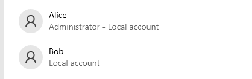
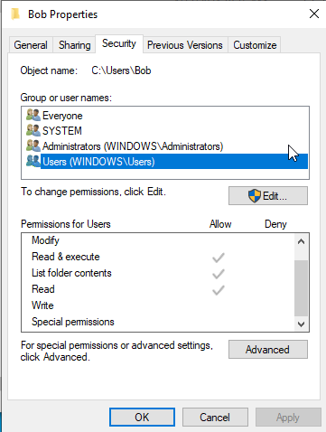
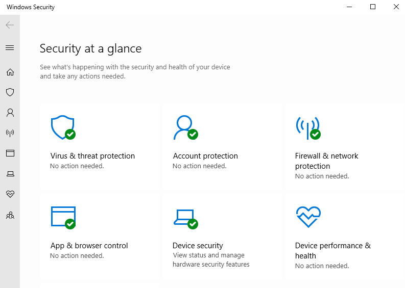

# Windows 10 Secure Environment Setup

 We have a VM with a fresh installation of Windows 10. We will be setting up two users, Alice and Bob. Alice will be an administrator, while Bob will be a standard user with restricted access to his user folder. We will also configure Windows Defender for antivirus and firewall protection.

## Installation
 We shall be using a Windows 10 Enterprise Evaluation ISO file to install it on a VM. 

## Configuration

After installing, the next steps involve user configuration and security setup.

### Adding Users

- Alice (Administrator)
- Bob (Standard User with Restricted Access)

### Security Setup
Windows Security will be used for Antivirus and Firewall protection.

